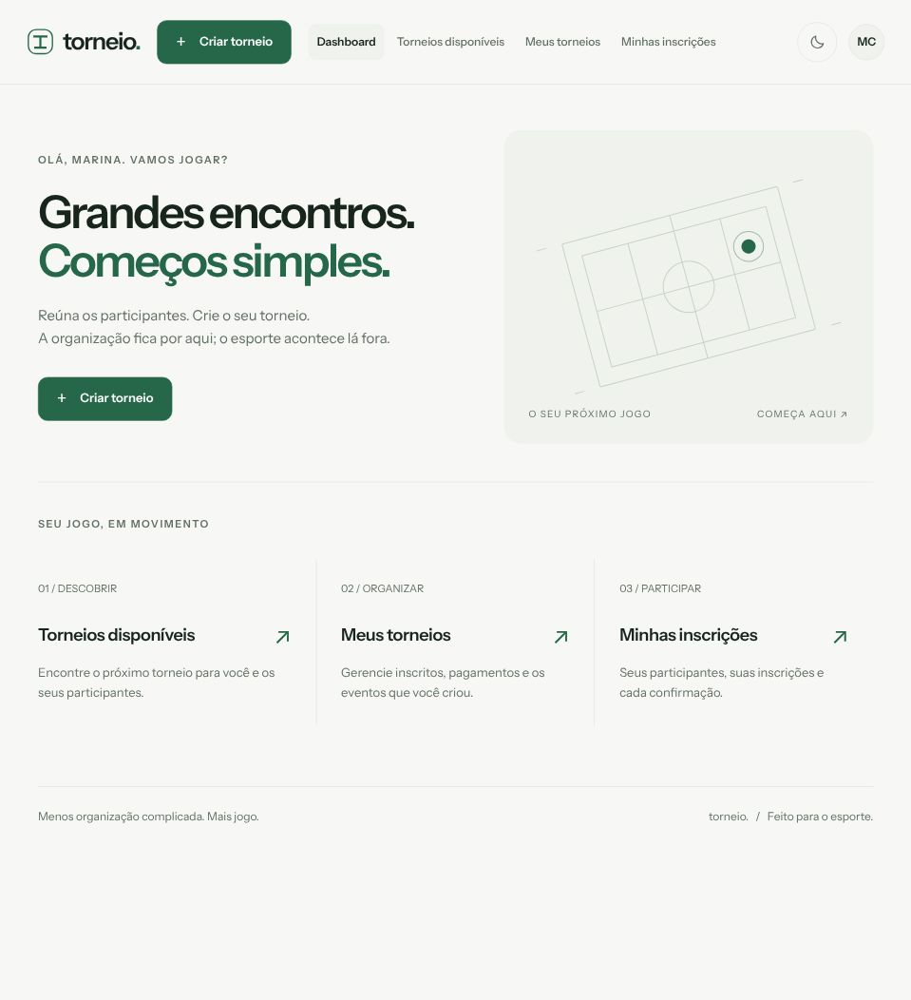
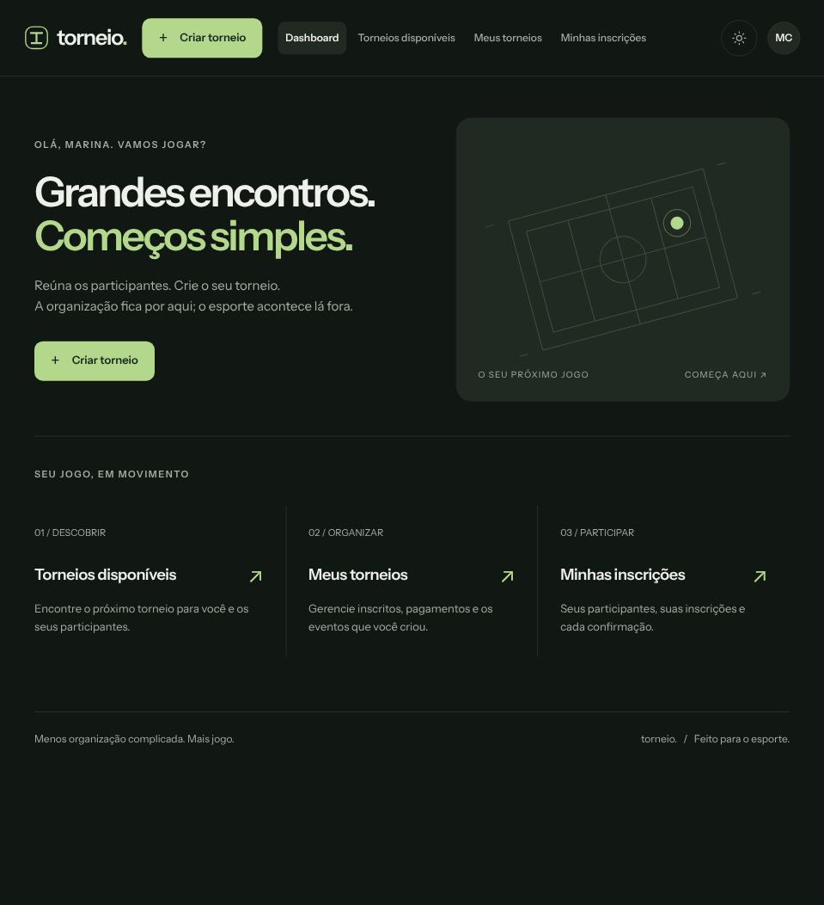
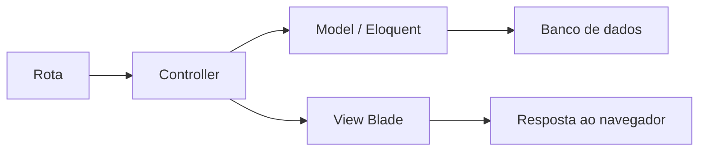
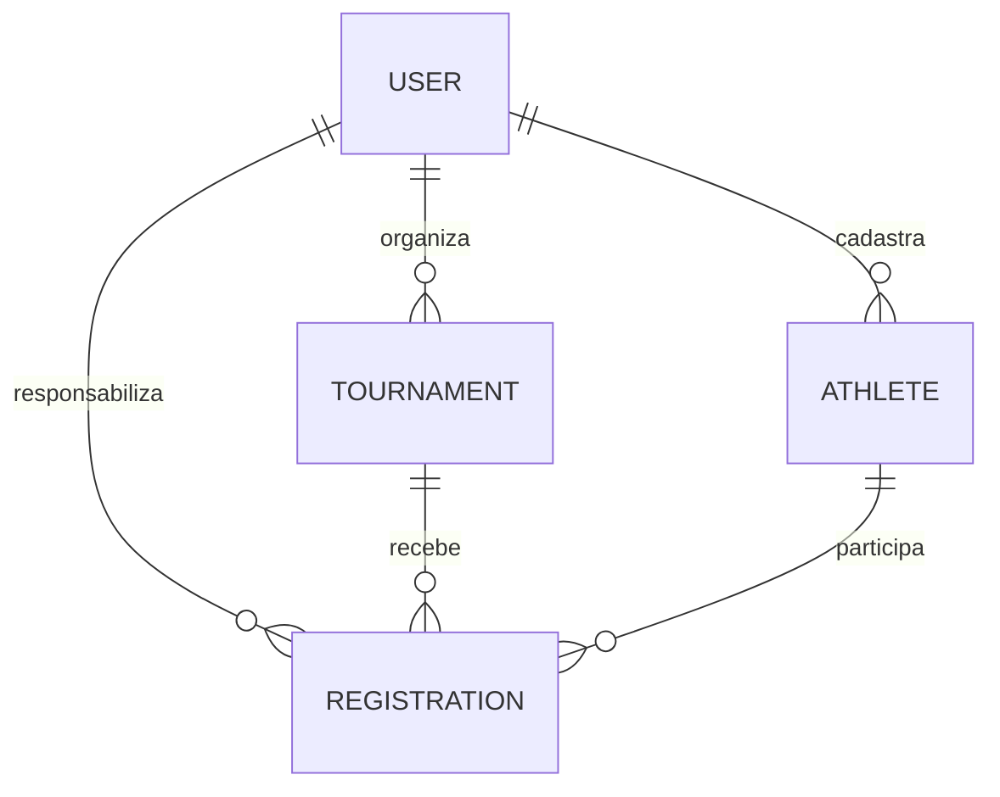

# Torneio — Do PHP Puro ao Laravel

Projeto desenvolvido como parte da minha evolução nos estudos de PHP, começando pelos fundamentos da linguagem e avançando até a construção de uma aplicação real com Laravel, PostgreSQL, Eloquent, autenticação, regras de negócio, segurança e testes.

**Mais jogo. Menos complicação.** O sistema permite organizar torneios esportivos, cadastrar participantes, realizar inscrições e acompanhar pagamentos Pix com confirmação manual. A interface oferece temas claro e escuro e navegação para desktop e celular.

Este README registra o caminho de aprendizado e as decisões que formaram a aplicação. O código publicado corresponde à versão Laravel; os exemplos de PHP puro documentam a etapa anterior, sem apresentar aquela implementação como parte deste repositório.

- [Instalação, execução e confirmação de e-mail](GUIA_DESENVOLVIMENTO.md).
- [Prints do aplicativo](#prints-do-aplicativo).
- [Mapa de rotas, telas e arquivos](#mapa-dos-caminhos-da-aplicação).
- [Estado atual e próximos passos](#status-atual).
- [Relatórios das etapas de desenvolvimento](#registros-do-desenvolvimento).

## Prints do aplicativo

Capturas reais do app nos temas claro e escuro. As telas usam um ambiente de demonstração separado, com contas, participantes, eventos e chave Pix fictícios.

| Tema claro | Tema escuro |
| --- | --- |
|  |  |

A [galeria completa com 20 prints](public/screenshots/README.md) mostra login, dashboard, torneios disponíveis, criação, página pública, gestão de inscritos, Minhas inscrições, pagamento Pix e navegação no celular. Cada tela possui uma versão clara e outra escura.

## Sobre o projeto

O Torneio nasceu como um projeto de estudo. A ideia inicial era simples: criar um sistema onde um organizador pudesse cadastrar torneios esportivos e permitir que pessoas se inscrevessem.

Conforme o projeto evoluiu, ele deixou de ser apenas um exercício de CRUD e passou a servir como laboratório para autenticação e autorização, modelagem de domínio, relacionamentos, inscrições, pagamentos, segurança, migrations, validações, integridade do banco, testes e separação entre área pública, área do participante e área do organizador.

O objetivo principal sempre foi entender por que cada camada existe, que problema ela resolve e como as decisões de arquitetura impactam o sistema.

## 1. Primeira etapa — PHP puro

Antes de utilizar um framework, comecei implementando funcionalidades com PHP puro. Essa etapa foi importante para compreender o que o Laravel posteriormente abstrairia.

Trabalhei com PHP, formulários HTML, HTTP, GET/POST, sessões, cookies, PDO, PostgreSQL, prepared statements, hashing de senhas, classes, objetos, namespaces, repositories, autenticação e organização de código.

Um dos primeiros aprendizados foi acessar o banco por PDO e consultas preparadas. Exemplo conceitual:

```php
$stmt = $pdo->prepare('SELECT * FROM users WHERE email = :email');
$stmt->execute(['email' => $email]);
```

Isso ajudou a compreender conexão com banco, parâmetros nomeados, prevenção de SQL Injection e a diferença entre consultas SQL e regras de negócio.

O cadastro de usuários começou sendo implementado manualmente:

```text
Formulário → POST → Validação → password_hash() → INSERT no PostgreSQL
```

Depois veio o login:

```text
E-mail e senha → Consulta ao banco → password_verify() → Sessão → Autenticação
```

Também precisei entender por que senhas não devem ser armazenadas em texto puro. Esses fundamentos facilitaram o entendimento de autenticação, middleware e sessão no framework.

## 2. Organização do código PHP

Concentrar HTML, SQL, autenticação, persistência e regra de negócio no mesmo arquivo começou a ficar inviável. Passei a estudar separação de responsabilidades por Controller, Repository, Model e View.

Mesmo antes de usar Laravel, essa organização ajudou a identificar a camada responsável por cada problema e preparou a reconstrução da aplicação.

## 3. Entrada no Laravel

Depois dos fundamentos em PHP puro, comecei uma nova versão seguindo a arquitetura do Laravel. O projeto foi reconstruído com os recursos do framework.

O ambiente utilizado foi PHP 8.5 com Laravel 13. A aplicação usa PostgreSQL, Eloquent, Blade, Fortify, Livewire, Flux, Tailwind CSS, Vite, Composer e Artisan. A verificação utiliza Pest, Laravel Pint e PHPStan com Larastan.

SQLite também está disponível para desenvolvimento. Os testes automatizados usam SQLite em memória, isolados do banco real. As versões exatas estão em [composer.lock](composer.lock) e [package-lock.json](package-lock.json).

## 4. Entendendo a arquitetura Laravel

Um dos principais aprendizados foi reconhecer a responsabilidade de cada parte do framework:



Passei a trabalhar diretamente com `routes/`, `app/Http/Controllers/`, `app/Models/`, `database/migrations/` e `resources/views/`. As configurações da conta utilizam componentes Livewire, com validação e ações executadas no servidor.

## 5. Autenticação

O projeto utiliza Laravel Fortify para cadastro, login, logout, recuperação de senha, confirmação de senha e verificação de e-mail. A alteração de senha e as configurações da conta usam a estrutura Livewire existente.

Uma rota pode exigir uma conta autenticada:

```php
->middleware('auth')
```

O dashboard exige também `verified`. O modelo `User` implementa `MustVerifyEmail`, e o fluxo de envio, reenvio e confirmação por URL assinada está implementado e coberto por testes.

No desenvolvimento, `MAIL_MAILER=log` registra a mensagem em `storage/logs/laravel.log`, sem entregá-la na caixa de e-mail. Por isso, uma conta nova pode autenticar e ainda ser encaminhada para a tela de confirmação. O [guia de desenvolvimento](GUIA_DESENVOLVIMENTO.md#entrar-quando-a-tela-pede-confirmação-de-e-mail) explica como obter o link local e configurar SMTP. A entrega real de e-mails permanece uma pendência de operação.

## 6. Criação de torneios

Uma das primeiras funcionalidades reais da versão Laravel foi criar torneios com nome, esporte, data, local, valor de inscrição e organizador. A chave Pix é configurada posteriormente pelo proprietário.

```text
User       → hasMany Tournament
Tournament → belongsTo User
```

O organizador pode criar e listar seus torneios, abrir e compartilhar a página pública, acessar o gerenciamento, configurar Pix, acompanhar inscritos e excluir um torneio vazio.

O vínculo com o organizador é definido pela relação da conta autenticada, sem aceitar um `user_id` arbitrário enviado pelo formulário.

## 7. Migrations

Passei a tratar a evolução do banco como parte do código, usando migrations incrementais. As tabelas principais são `users`, `tournaments`, `athletes` e `registrations`.

A sequência de mudanças do domínio está em [database/migrations/](database/migrations/):

| Etapa | Migration | Decisão |
| --- | --- | --- |
| Torneios | `2026_09_18_185321_create_tournaments_table.php` | Estrutura do evento e vínculo com o organizador |
| Inscrições | `2026_09_22_003224_create_registrations_table.php` | Participação e estado do pagamento |
| Pix | `2026_09_22_191628_change_pix_key_to_text_on_tournaments_table.php` | Coluna `TEXT` para comportar o valor criptografado |
| Dados de recebimento | `2026_09_23_173604_add_pix_receiver_fields_to_tournaments_table.php` | Evolução dos campos Pix |
| Participantes | `2026_09_23_183925_create_athletes_table.php` | Pessoa que compete separada da conta |
| Vínculo da inscrição | `2026_09_23_184823_add_athlete_id_to_registrations_table.php` | Associação da inscrição ao participante |
| Unicidade | `2026_09_23_210500_change_registration_unique_constraint.php` | Um atleta só pode aparecer uma vez no mesmo torneio |

As migrations padrão do Laravel também criam usuários, sessões, cache e filas. Essa organização permite aplicar alterações pendentes sem depender de apagar e recriar o banco.

## 8. Eloquent ORM

Outro avanço foi substituir consultas SQL manuais por relacionamentos do Eloquent:

```php
$user->tournaments();
$tournament->registrations();
$user->athletes();
$registration->athlete();
```

O código ficou mais expressivo. Relações como `registrations.athlete` permitem carregar os participantes realmente inscritos; `withCount('registrations')` fornece a contagem real na lista do organizador.

## 9. Evolução da modelagem

Uma das maiores mudanças aconteceu quando percebi que **usuário e atleta representam coisas diferentes**.

Inicialmente, o sistema trabalhava praticamente com uma conta por participante. Isso impedia uma pessoa de usar sua conta para inscrever outros participantes. A entidade `Athlete` passou a representar cada pessoa que compete:

```text
Conta Rodrigo
├── Rodrigo
├── Esposa
├── Participante 3
└── Participante 4
```

A conta continua sendo responsável pelas inscrições e pela autenticação. O limite de quatro vale por conta e por torneio, sem limitar o cadastro total de atletas da conta.

## 10. Arquitetura atual do domínio



| Entidade | Responsabilidade |
| --- | --- |
| `User` | Conta responsável e organizador dos seus torneios |
| `Athlete` | Pessoa que vai competir, vinculada a uma conta |
| `Tournament` | Competição com data, local, esporte e valor |
| `Registration` | Participação de um atleta em determinado torneio |

A inscrição guarda duas identidades diferentes:

```text
user_id    → conta responsável pela inscrição
athlete_id → pessoa que compete
```

## 11. Cadastro de participantes

Criar um `Athlete` adiciona uma pessoa à conta. Criar uma `Registration` a inscreve em um torneio. São ações separadas.

O formulário de participante preserva o torneio de origem e retorna com o novo atleta selecionado. O usuário ainda precisa clicar em **Inscrever-se** para concluir a participação.

Essa separação evita tratar toda pessoa cadastrada como se estivesse inscrita em todos os eventos.

## 12. Inscrição de participantes

O caminho do participante foi definido assim:

```text
Torneios disponíveis / Link público
→ Acessar torneio
→ Entrar na conta
→ Selecionar participante ou cadastrar outro
→ Clicar em Inscrever-se
→ Minha inscrição
→ Acompanhar em Minhas inscrições
```

Antes de criar a inscrição, o sistema verifica a existência do torneio e do atleta, o pertencimento do atleta à conta, uma inscrição já existente e o limite por torneio.

Se a inscrição já existe, o sistema abre seus detalhes. Essa verificação acontece antes do limite, inclusive quando a conta já possui quatro inscritos.

## 13. Limite de participantes

Para o MVP, uma conta pode realizar até **quatro inscrições por torneio**. A quinta inscrição é recusada, enquanto inscrições em outros torneios continuam possíveis.

A criação utiliza transação, bloqueio da conta e bloqueio do torneio, com até três tentativas em conflitos transacionais. O banco também mantém a restrição de unicidade.

Os testes funcionais comprovam o limite e as repetições de inscrição. Uma validação com processos simultâneos em PostgreSQL isolado permanece pendente; os testes em SQLite não comprovam esse comportamento sob concorrência real.

## 14. Evitando inscrições duplicadas

A restrição inicial era:

```php
unique(['tournament_id', 'user_id']);
```

Ela impedia vários participantes da mesma conta no mesmo torneio. A regra foi alterada para:

```php
unique(['tournament_id', 'athlete_id']);
```

Assim, atletas diferentes da mesma conta podem participar juntos, e o mesmo atleta continua impedido de possuir duas inscrições no mesmo evento.

## 15. Separação entre páginas públicas e administrativas

A aplicação passou a separar a descoberta de eventos, a participação e a gestão:

| Página | Caminho | Público responsável |
| --- | --- | --- |
| Torneios disponíveis | `/tournaments/available` | Visitantes e participantes |
| Página pública do torneio | `/tournaments/{tournament}` | Qualquer interessado no evento |
| Meus torneios | `/tournaments` | Organizador autenticado |
| Gerenciar torneio | `/tournaments/{tournament}/manage` | Proprietário do evento |
| Minhas inscrições | `/registrations` | Conta responsável |
| Minha inscrição | `/registrations/{registration}` | Conta responsável por essa inscrição |

Esses nomes também orientam os menus e os retornos dos formulários.

## 16. Gerenciamento de participantes inscritos

A área de gerenciamento foi concluída com nome do atleta, status, data da inscrição e ações de confirmação ou remoção. Ela lista somente participantes que possuem uma `Registration` naquele torneio.

**Remover uma inscrição preserva o atleta.** A pessoa continua cadastrada na conta responsável e pode ser inscrita novamente. A remoção exige que a inscrição pertença ao torneio gerenciado e que a conta seja proprietária desse torneio.

## 17. Exclusão de torneios e contas

Um torneio com inscrições não pode ser excluído. Depois da remoção de todas as inscrições, o proprietário pode excluir o evento. A operação utiliza transação e bloqueio dos registros envolvidos.

A exclusão da conta também considera seus vínculos: fica bloqueada enquanto houver inscrições próprias, inscrições dos seus atletas ou participantes inscritos nos torneios que ela organiza.

Quando não existem esses vínculos, a transação remove atletas sem inscrição, torneios vazios e a conta. O logout acontece após o sucesso; uma falha de integridade reverte a operação e mantém a sessão.

## 18. Pagamentos

Inicialmente considerei cobranças individuais. Para manter o MVP simples, a decisão foi utilizar **chave Pix fixa por torneio e confirmação manual**.

A inscrição possui `payment_status` e `payment_confirmed_at`:

| Situação | Comportamento |
| --- | --- |
| Torneio pago | Inscrição começa como `pending`; a conta responsável consulta as instruções privadas |
| Recebimento conferido | Organizador confirma manualmente; status passa a `confirmed` e a data é registrada |
| Confirmação repetida | Mantém a data original, sem confirmar novamente |
| Torneio gratuito | Nova inscrição recebe confirmação automática, sem pedir pagamento |

O organizador não pode confirmar o próprio pagamento, mesmo quando é responsável pela inscrição. Depois da confirmação, os detalhes deixam de exibir a chave Pix e as instruções.

Inscrições antigas de torneios gratuitos ainda pendentes são apresentadas como gratuitas, preservando os dados existentes. O sistema não integra gateway nem comprova recebimento bancário automaticamente.

## 19. Segurança da chave Pix

Uma chave Pix pode conter CPF, CNPJ, telefone ou e-mail. Foi utilizado o cast criptografado do Laravel:

```php
protected function casts(): array
{
    return [
        'pix_key' => 'encrypted',
    ];
}
```

A coluna foi alterada para `TEXT`, porque o valor criptografado pode ultrapassar o tamanho de uma string tradicional. O campo também fica oculto na serialização do modelo.

A chave não aparece nas listagens nem na página pública. Somente o proprietário pode configurá-la, e somente a conta responsável pela inscrição consulta as instruções privadas enquanto o pagamento está pendente. `dontFlash(['pix_key'])` impede que uma falha de validação leve a chave para os dados antigos da sessão.

A descriptografia depende da `APP_KEY`. Instalações existentes precisam preservar essa chave. `.env`, bancos locais e logs ficam fora do versionamento.

## 20. Segurança e autorização

Além do login, trabalhei com CSRF, mass assignment, IDOR, autorização, pertencimento de registros, validação e criptografia.

No gerenciamento, o torneio é buscado pela relação do usuário autenticado:

```php
$request->user()
    ->tournaments()
    ->findOrFail($tournament);
```

Isso restringe a administração aos próprios eventos. A página pública pode consultar um torneio sem esse filtro de proprietário, pois seu acesso é público e sua apresentação não expõe dados privados.

Os parâmetros de identificação das rotas usam `whereNumber`, evitando erros de servidor causados por IDs malformados. Os formulários de alteração usam proteção CSRF.

## 21. Proteção das inscrições

A página privada da inscrição é carregada pela conta responsável:

```php
$request->user()
    ->registrations()
    ->findOrFail($registration);
```

Trocar o ID na URL não permite consultar inscrições de outra conta. A listagem **Minhas inscrições** segue o mesmo filtro e carrega os dados do atleta e do torneio por relacionamentos.

## 22. Mass Assignment

Foi necessário compreender o papel de `$fillable`. Em `Registration`, os campos permitidos são:

```php
protected $fillable = [
    'tournament_id',
    'athlete_id',
];
```

O formulário do participante não controla `user_id`, `payment_status` ou `payment_confirmed_at`. A relação da conta autenticada define o responsável, e o servidor define os estados de pagamento.

Isso evita que campos adicionais enviados pelo cliente alterem permissões ou simulem uma confirmação.

## 23. Validação de formulários

Os formulários utilizam `$request->validate()`, `$errors` e `old()` para apresentar erros e preservar dados preenchidos, com exceção de informações sensíveis como a chave Pix.

As validações abrangem campos obrigatórios, valor da inscrição, existência do torneio e do atleta, pertencimento do participante e duplicidade.

O valor da inscrição aceita de zero até `99999999.99`, com no máximo duas casas decimais. Valores negativos, acima da capacidade da coluna, em notação científica ou com precisão excessiva são rejeitados.

## 24. Testes e auditoria técnica

Comecei a exigir evidências além de abrir uma tela no navegador. O projeto passou por inspeção de rotas, sintaxe PHP, migrations, compilação Blade, Pest e análise estática.

Os cenários incluem inscrição e repetição, limite de quatro, atletas de outra conta, falsificação de responsável e pagamento, acessos sem login, gestão por proprietário, exclusões com vínculos, gratuidade, confirmação manual, privacidade do Pix, verificação de e-mail e rollback na exclusão da conta.

Na validação de 04/10/2026, a suíte completa registrou **154 testes aprovados, 2 ignorados e 801 asserções**, sem falhas. Os dois casos ignorados pertencem ao recurso de dois fatores desabilitado. Build de assets e PHPStan também passaram.

```bash
php artisan test --compact --fail-on-risky
composer lint:check
vendor/bin/phpstan analyse --debug --no-progress --memory-limit=512M
npm run build
```

Os testes usam SQLite em memória, com configuração isolada em [phpunit.xml](phpunit.xml). O `--debug` do PHPStan permite executar a análise sem o paralelismo que exige um socket local em ambientes restritos.

O redesign foi conferido no navegador por DOM, dimensões, estilos computados e interações em desktop, tablet e celular. A captura de screenshots, que havia falhado na primeira etapa, foi concluída posteriormente: os 20 prints reais estão na [galeria](public/screenshots/README.md). Os resultados estão no [relatório de redesign](RELATORIO_REDESIGN.md).

Na primeira publicação, os checks do GitHub identificaram uma diferença entre ambientes: o parser legado `DOMDocument::loadHTML()` rejeitou tags HTML5 utilizadas nas telas. Os testes de formulários passaram a usar [`Dom\HTMLDocument::createFromString()`](https://www.php.net/manual/en/dom-htmldocument.createfromstring.php) e `Dom\XPath`, disponíveis desde PHP 8.4. As verificações de CSRF, valores preenchidos e seleção de participantes foram preservadas. Essa correção permanece limitada à leitura de HTML nos testes.

## 25. Bugs também fazem parte do aprendizado

Durante o projeto ocorreram métodos dentro de outros métodos, chaves fora do lugar, código de Controller colado em rotas, erro de digitação em migration, métodos duplicados, problemas de sessão ao alternar `localhost` e `127.0.0.1` e constraints incompatíveis com novas regras.

Resolver esses erros exigiu investigar onde estava a falha, por que acontecia e qual camada deveria ser corrigida. Também ficou claro que uma mensagem de confirmação de e-mail pode indicar uma configuração de entrega pendente, mesmo quando a autenticação funciona.

A investigação passou a considerar rotas, middleware, dados, relacionamentos, configuração e testes antes de alterar o código.

## 26. PHP puro x Laravel

Laravel organiza e abstrai conceitos que já existem. Ter construído partes manualmente tornou mais fácil entender suas ferramentas:

| PHP puro | Recursos usados no Laravel |
| --- | --- |
| `$_POST` e tratamento manual de entrada | `Request` e validação |
| PDO e SQL preparado | Eloquent e query builder |
| Sessões e autenticação manual | Auth, Fortify e middleware |
| `include` e HTML | Blade e componentes |
| `password_hash()` / `password_verify()` | Hash e Fortify |
| Alterações manuais no banco | Migrations e constraints versionadas |

## 27. O principal aprendizado

Quando comecei, meu foco era: **como escrever esse código?** Durante o projeto, as perguntas passaram a incluir: **essa arquitetura faz sentido? Quem deveria ter permissão para fazer isso? Essa regra pertence ao Controller ou ao banco?**

O estudo deixou de ser apenas sobre sintaxe PHP e passou a envolver engenharia de software: modelagem, limites de responsabilidade, integridade, autorização e evidências de funcionamento.

## Redesign, tema claro e tema escuro

Depois do fechamento funcional, a interface recebeu uma identidade esportiva em verde, tipografia consistente, componentes compartilhados, feedback de formulários, estados vazios e organização dos status de pagamento.

O seletor de sol/lua alterna entre claro e escuro, com preferência persistente. Em **Configurações da conta → Appearance**, também é possível acompanhar o tema do sistema. As telas de autenticação, os fluxos do torneio e as configurações utilizam os layouts compartilhados.

No desktop, a navegação fica no cabeçalho. No celular, uma barra inferior dá acesso a dashboard, torneios disponíveis, meus torneios e minhas inscrições. **Criar torneio** permanece como ação principal. Os números exibidos vêm dos dados reais da aplicação.

| Elemento | Tema claro | Tema escuro |
| --- | --- | --- |
| Fundo | `#F7F8F5` | `#111713` |
| Superfícies | `#FFFFFF` | `#19211B` |
| Texto principal | `#17251D` | `#EDF1E9` |
| Cor de ação | `#276749` | `#B4D88B` |

A paleta está em [resources/css/app.css](resources/css/app.css), e os componentes em [resources/views/components/ui/](resources/views/components/ui/).

## Mapa dos caminhos da aplicação

### Rotas públicas e entrada

| Método | Caminho | Nome da rota | Destino / proteção |
| --- | --- | --- | --- |
| GET | `/` | `home` | Apresentação em `welcome.blade.php` |
| GET | `/tournaments/available` | `tournaments.available` | `TournamentController@available`; eventos de hoje e futuros |
| GET | `/tournaments/{tournament}` | `tournaments.show` | `TournamentController@show`; página pública |
| GET | `/dashboard` | `dashboard` | `dashboard.blade.php`; `auth` e `verified` |

### Caminho do organizador

```text
Dashboard → Criar torneio → Meus torneios → Gerenciar
→ Configurar Pix / Compartilhar link público
→ Acompanhar inscritos → Confirmar recebimento ou remover inscrição
→ Excluir torneio quando estiver vazio
```

As rotas abaixo exigem `auth`; as operações de gestão consultam o torneio pela relação do proprietário.

| Método | Caminho | Nome da rota | Destino |
| --- | --- | --- | --- |
| GET | `/tournaments` | `tournaments.index` | `TournamentController@index` |
| GET | `/tournaments/create` | `tournaments.create` | `tournaments/create.blade.php` |
| POST | `/tournaments` | `tournaments.store` | `TournamentController@store` |
| GET | `/tournaments/{tournament}/manage` | `tournaments.manage` | `TournamentController@manage` |
| PATCH | `/tournaments/{tournament}/pix-key` | `tournaments.pix-key.update` | `TournamentController@updatePixKey` |
| DELETE | `/tournaments/{tournament}/registrations/{registration}` | `tournaments.registrations.destroy` | `RegistrationController@destroy`; preserva o atleta |
| PATCH | `/tournaments/{tournament}/registrations/{registration}/confirm-payment` | `tournaments.registrations.confirm-payment` | `RegistrationController@confirmPayment`; bloqueia confirmação própria |
| DELETE | `/tournaments/{tournament}` | `tournaments.destroy` | `TournamentController@destroy`; exige ausência de inscrições |

### Caminho do participante

```text
Torneios disponíveis → Página pública → Login
→ Escolher participante ou cadastrar novo → Inscrever-se
→ Minha inscrição → Minhas inscrições
```

As rotas abaixo exigem `auth`, com consultas limitadas à conta responsável.

| Método | Caminho | Nome da rota | Destino |
| --- | --- | --- | --- |
| GET | `/athletes/create` | `athletes.create` | `AthleteController@create`; preserva o torneio de origem |
| POST | `/athletes` | `athletes.store` | `AthleteController@store`; cadastra sem inscrever |
| POST | `/registrations` | `registrations.store` | `RegistrationController@store`; valida participante e limite |
| GET | `/registrations` | `registrations.index` | `RegistrationController@index`; inscrições da conta |
| GET | `/registrations/{registration}` | `registrations.show` | `RegistrationController@show`; detalhes privados |

### Autenticação e configurações

As rotas de autenticação vêm do Fortify. O cadastro, login e recuperação são destinados a visitantes; logout e verificação exigem autenticação.

| Método | Caminho | Finalidade |
| --- | --- | --- |
| GET / POST | `/register` | Cadastro de conta |
| GET / POST | `/login` | Login |
| POST | `/logout` | Encerrar a sessão |
| GET / POST | `/forgot-password` | Solicitar recuperação de senha |
| GET | `/reset-password/{token}` | Abrir formulário de recuperação |
| POST | `/reset-password` | Definir nova senha |
| GET | `/email/verify` | Aviso de confirmação de e-mail |
| POST | `/email/verification-notification` | Reenviar notificação; limite de tentativas |
| GET | `/email/verify/{id}/{hash}` | Confirmar e-mail; URL assinada e limite de tentativas |
| GET / POST | `/user/confirm-password` | Confirmar senha para ações protegidas |
| GET | `/user/confirmed-password-status` | Consultar o estado de confirmação da senha |
| GET | `/settings` | Redirecionar para o perfil; `auth` |
| GET | `/settings/profile` | Perfil; `auth` |
| GET | `/settings/appearance` | Aparência; `auth` e `verified` |
| GET | `/settings/security` | Segurança; `auth`, `verified` e `password.confirm` |

A exclusão da conta é uma ação do componente Livewire existente, sem rota de domínio adicional. Endpoints de assets, uploads, atualização Livewire, storage e saúde pertencem à infraestrutura; o inventário completo pode ser consultado com `php artisan route:list --no-interaction`.

### Arquivos e responsabilidades

Todos os caminhos abaixo são relativos à raiz do repositório.

| Caminho | O que concentra |
| --- | --- |
| [routes/web.php](routes/web.php) | Rotas públicas e fluxos de torneios, participantes e inscrições |
| [routes/settings.php](routes/settings.php) | Rotas das configurações da conta |
| [app/Http/Controllers/TournamentController.php](app/Http/Controllers/TournamentController.php) | Listagem, criação, página pública, gerenciamento, Pix e exclusão |
| [app/Http/Controllers/AthleteController.php](app/Http/Controllers/AthleteController.php) | Cadastro de participante e retorno ao torneio |
| [app/Http/Controllers/RegistrationController.php](app/Http/Controllers/RegistrationController.php) | Inscrição, listagem privada, detalhes, remoção e confirmação |
| [app/Models/](app/Models/) | `User`, `Athlete`, `Tournament` e `Registration`, relações e casts |
| [app/Actions/Fortify/](app/Actions/Fortify/) | Cadastro da conta e redefinição de senha |
| [app/Providers/FortifyServiceProvider.php](app/Providers/FortifyServiceProvider.php) | Views e configuração dos fluxos de autenticação |
| [config/fortify.php](config/fortify.php) | Recursos de autenticação habilitados |
| [bootstrap/app.php](bootstrap/app.php) | Inicialização, middleware e proteção de `pix_key` no flash |
| [database/migrations/](database/migrations/) | Esquema, chaves estrangeiras e unicidade |
| [resources/views/tournaments/](resources/views/tournaments/) | Criar, listar, descobrir, visualizar e gerenciar torneios |
| [resources/views/athletes/create.blade.php](resources/views/athletes/create.blade.php) | Cadastro de participante |
| [resources/views/registrations/](resources/views/registrations/) | Minhas inscrições e detalhes privados |
| [resources/views/dashboard.blade.php](resources/views/dashboard.blade.php) | Entrada autenticada e atalhos dos fluxos |
| [resources/views/pages/auth/](resources/views/pages/auth/) | Login, cadastro, recuperação e verificação |
| [resources/views/pages/settings/](resources/views/pages/settings/) | Perfil, aparência, segurança e exclusão da conta |
| [resources/views/components/ui/](resources/views/components/ui/) | Layout, botão, campo, feedback, status, card, data, ilustração e seletor de tema |
| [resources/views/layouts/](resources/views/layouts/) | Layouts compartilhados da aplicação e autenticação |
| [resources/views/partials/tournament-navigation.blade.php](resources/views/partials/tournament-navigation.blade.php) | Navegação dos fluxos do torneio |
| [resources/css/app.css](resources/css/app.css) | Temas, paleta, tipografia e responsividade |
| [resources/js/app.js](resources/js/app.js) | Entrada dos assets JavaScript |
| [public/screenshots/](public/screenshots/) | Prints reais dos dois temas e galeria das telas |
| [tests/Feature/](tests/Feature/) | Regras do domínio, autorização, autenticação e configurações |
| [phpunit.xml](phpunit.xml) / [phpstan.neon](phpstan.neon) | Isolamento dos testes e análise estática |
| [.env.example](.env.example) | Modelo de configuração sem credenciais reais |
| [GUIA_DESENVOLVIMENTO.md](GUIA_DESENVOLVIMENTO.md) | Instalação, execução, e-mail e comandos de qualidade |

## Tecnologias utilizadas

| Etapa / área | Tecnologias |
| --- | --- |
| Fundamentos | PHP, HTML Forms, HTTP, sessões, cookies, PDO e PostgreSQL |
| Backend atual | PHP, Laravel 13, Eloquent, Composer e Artisan |
| Autenticação | Fortify e recursos de sessão do Laravel |
| Interface | Blade, Livewire 4, Flux 2 e Alpine.js |
| Estilos e assets | Tailwind CSS 4, Vite 8 e Vite+ |
| Qualidade | Pest 5, PHPStan, Larastan e Laravel Pint |
| Versionamento | Git e GitHub |

## Status atual

O núcleo funcional do MVP foi implementado e validado. Isso inclui autenticação, criação e descoberta de torneios, páginas públicas, cadastro de atletas, inscrições, limite por conta, gerenciamento, confirmação manual, gratuidade, Minhas inscrições, Pix criptografado, autorização, exclusão segura da conta, navegação e redesign com temas claro e escuro.

**A disponibilização para usuários reais depende da entrega de e-mails.** O ambiente de desenvolvimento usa `log`; é necessário configurar um transporte de entrega e verificar o recebimento e o acesso ao dashboard. O fluxo de confirmação já existe.

Também permanecem pendentes a comprovação de concorrência com requisições simultâneas em PostgreSQL isolado e a tradução de textos remanescentes nas configurações. A autenticação em duas etapas está desabilitada e não foi validada como funcionalidade completa.

Os relatórios registram a situação de cada etapa na sua data. Uma pendência de um relatório antigo pode já ter sido resolvida na etapa seguinte; este README descreve o estado consolidado.

## Fora do escopo atual do MVP

Cartão, gateway de pagamento, Pix dinâmico, QR Code individual, reservas de quadras, associados, ranking, chaveamentos avançados e painel administrativo global foram deixados para versões futuras.

A decisão é concluir a operação do núcleo antes de expandir o produto.

## Caminho percorrido e próximos passos

A sequência de trabalho passou por fundamentos em PHP puro, separação de responsabilidades, reconstrução em Laravel, migrations e relacionamentos, distinção entre conta e atleta, inscrição explícita, auditoria de rotas e segurança, fechamento funcional e redesign.

No fechamento, foram concluídos o gerenciamento de inscritos, a confirmação manual, as correções de validação, Minhas inscrições, o tratamento de gratuidade, a exclusão segura da conta, a navegação e os testes. Em seguida, foram aplicados a identidade visual, a responsividade e os dois temas.

Os próximos passos são configurar e comprovar a entrega de e-mails, testar concorrência em PostgreSQL isolado e concluir a tradução restante. Funcionalidades adicionais podem ser avaliadas após essas verificações.

## Registros do desenvolvimento

- [Galeria de prints do aplicativo](public/screenshots/README.md): telas reais nos temas claro e escuro, incluindo o celular.
- [Auditoria e evolução de 01/10/2026](RELATORIO_DESENVOLVIMENTO_2026-10-01.md): rotas, domínio, validação, Pix, acesso e problemas encontrados.
- [Fechamento funcional do MVP](RELATORIO_FECHAMENTO_MVP.md): decisões finais, correções, testes e pendência de e-mail.
- [Redesign e verificações dos temas](RELATORIO_REDESIGN.md): identidade, componentes, telas, navegação e limites da validação visual.
- [Medidas registradas no navegador](VERIFICACOES_REDESIGN.json): evidência de DOM e estilos do ambiente isolado com dados fictícios.
- [Guia de desenvolvimento](GUIA_DESENVOLVIMENTO.md): configuração e uso local.

## Objetivo deste repositório

Este projeto documenta minha evolução estudando PHP puro, orientação a objetos, banco de dados, arquitetura, Laravel, Eloquent, segurança, testes e regras de negócio reais.

Construí-lo tem mostrado que aprender programação envolve rever decisões. Uma funcionalidade pode funcionar tecnicamente e ainda ter uma modelagem inadequada. Em vários momentos foi necessário alterar relacionamentos, ajustar constraints e reconstruir partes do sistema.

Esse processo continua sendo tão importante quanto o código final. A intenção é evoluir a aplicação conforme meu conhecimento em PHP e Laravel também evolui.
